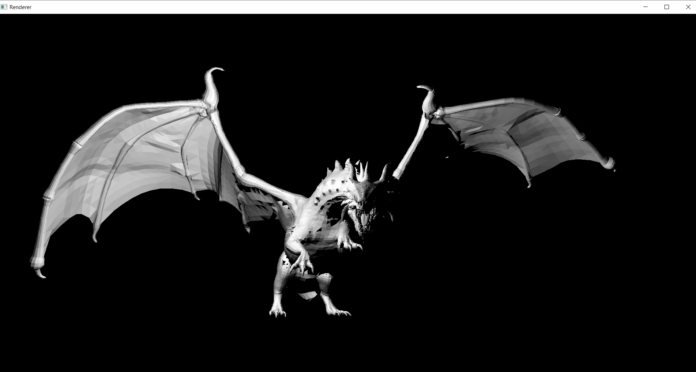

# OBJ File Renderer

A lightweight OBJ file renderer written in C# using the SFML library. This project includes XUnit tests, an SFML-based presentation, manual matrix transformation capabilities, and dependency injection for extensibility. It also features a manual OBJ file parser for maximum control.

## Features

- Rendering of OBJ files
- Manually parsed OBJ files
- XUnit tests for code validation
- SFML-based presentation for 3D visualization
- Manual matrix transformation for manipulating models
- Camera Position Adjustment
- Dependency injection for flexibility and modularity

### Manual Matrix Transformation

For manual matrix transformations and a deeper understanding of coordinate systems and transformations, you can refer to the [LearnOpenGL tutorial](https://learnopengl.com/Getting-started/Coordinate-Systems).

### Camera Position Adjustment

This application also provides users with the ability to dynamically change the camera position.  
For a deeper understanding of camera positioning and the spherical coordinate system, you can refer to the [Wikipedia article on Spherical Coordinate Systems](https://en.wikipedia.org/wiki/Spherical_coordinate_system).

To run this project, you need to have the following prerequisites installed:

- .NET Core SDK
- SFML.NET
